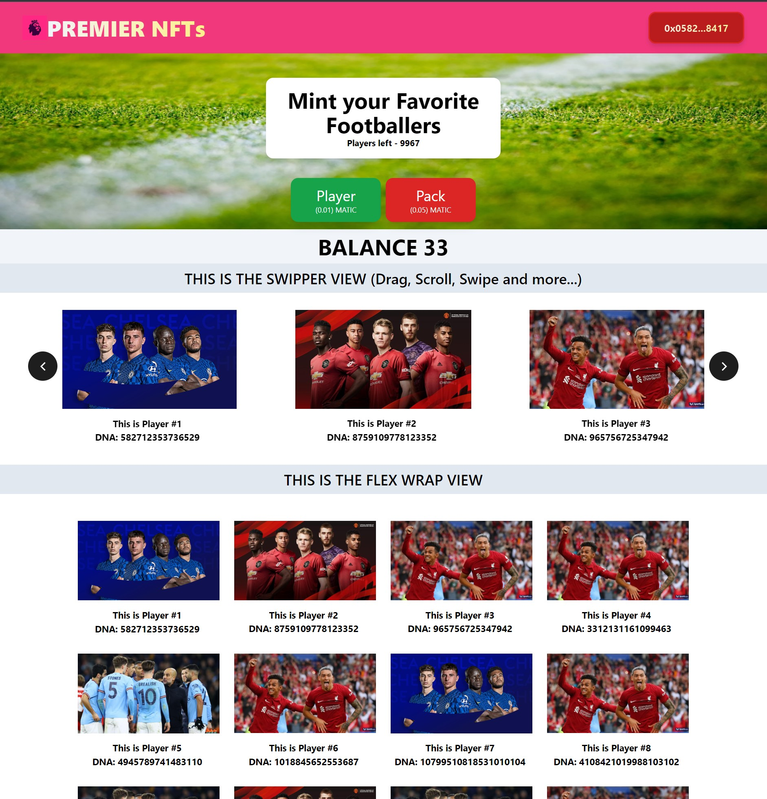

# Getting Started
These instructions will help you clone and run a React app locally on your machine.

## Prerequisites
To run a React app locally, you'll need to have Node.js and npm (Node Package Manager) installed on your machine. You can download Node.js from the official website: https://nodejs.org/

## Installing
1. Clone the repository to your local machine using Git.
``git clone https://github.com/Luiscmogrovejo/Premier-League-Test-NFTs``

2. Navigate to the project directory.
``cd premier-league-test-nfts``

3. Install the required dependencies using npm.
``npm install``

## Running
To start the development server, run the following command:
``npm start``
Open your web browser and navigate to http://localhost:3000 to view the app.

You can now make changes to the code and see them reflected in the app as you save.

## Building
To create a production build of the app, run the following command:
``npm run build``
The built files will be placed in the build directory, which can be deployed to a web server.

## Contributing
Please read CONTRIBUTING.md for details on our code of conduct and the process for submitting pull requests.

## License
This project is licensed under the MIT License - see the LICENSE.md file for details.
